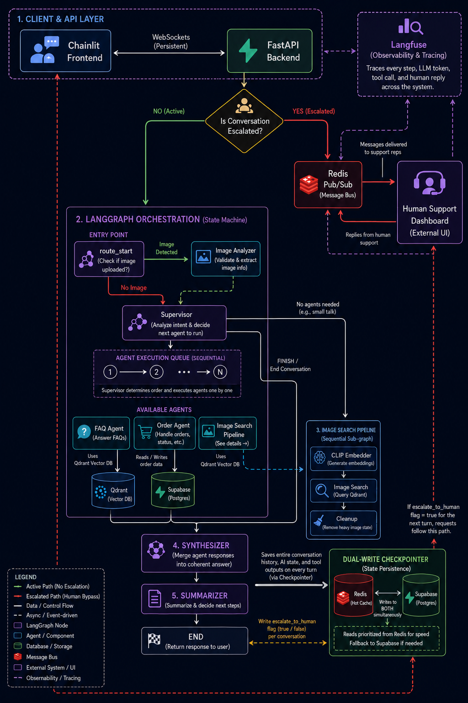
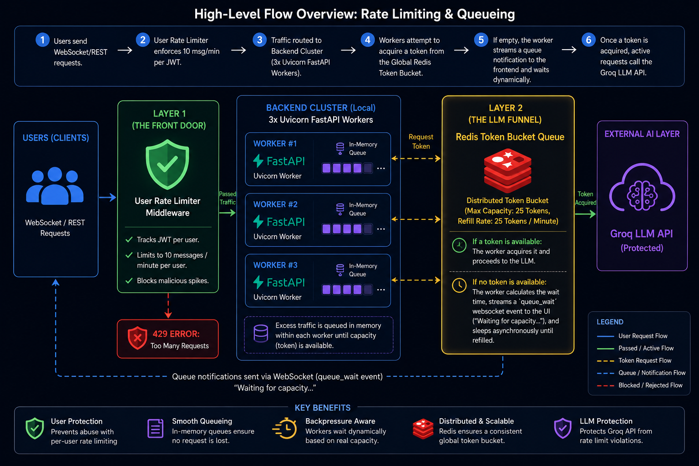

<p align="center">
  <h1 align="center">🛒 E-Commerce Customer Assistant</h1>
  <p align="center">
    An AI-powered multi-agent customer support system with visual product search, built with LangGraph, FastAPI, and Chainlit.
  </p>
</p>

<p align="center">
  <a href="#features">Features</a> •
  <a href="#architecture">Architecture</a> •
  <a href="#tech-stack">Tech Stack</a> •
  <a href="#getting-started">Getting Started</a> •
  <a href="#deployment">Deployment</a> •
  <a href="#api-reference">API Reference</a> •
  <a href="#license">License</a>
</p>

---

## Features

- **🤖 Multi-Agent Orchestration** — A supervisor agent intelligently routes user queries to specialized sub-agents (FAQ, Order, Image Search) using LangGraph's state machine.
- **📦 Order Management** — Customers can check order status, view order details, track shipments, and look up past purchases using natural language.
- **❓ FAQ Knowledge Base** — RAG-powered FAQ agent retrieves answers from a curated knowledge base covering shipping, returns, payments, warranties, and account policies.
- **🖼️ Multimodal Product Search** — Upload a product image and the system extracts tags using Azure Vision and finds visually and semantically similar products via Qdrant Hybrid Search.
- **💬 Persistent Chat Memory** — Dual-layer checkpointing system with Redis (hot cache) and Postgres (durable storage) ensures blazing-fast conversation recall with zero data loss.
- **📝 Automatic Summarization** — A dedicated summarizer agent condenses long conversation histories to keep context windows lean and inference costs low.
- **🔐 JWT Authentication** — Secure, stateless authentication via JSON Web Tokens tied to customer identities.
- **🔄 LLM Fallback Chain** — Primary model (Groq) with automatic fallback to OpenAI and secondary Groq models, ensuring high availability.
- **🧪 DeepEval Evaluation** — Built-in test suites using Confident AI's DeepEval framework to measure RAG retrieval and faithfulness.
- **🚀 CI/CD Pipeline** — Fully automated GitHub Actions workflow that builds, containerizes, and deploys to Azure Container Apps on every push.

---

## Architecture



The application uses a decoupled frontend-backend architecture:
- **FastAPI Backend:** Orchestrates LangGraph agents, manages databases, and exposes REST endpoints.
- **Chainlit Frontend:** A rich, React-based Chat UI providing seamless multimodal interactions.
- **Persistent WebSockets:** While authentication and chat history use REST, real-time message streaming (including reasoning tokens and tool execution steps) flows over a persistent WebSocket connection between Chainlit and FastAPI.

### LangGraph Workflow
1. **Entry Point**: Checks if the user uploaded an image. If yes, routes to **Image Analyzer**. Otherwise, routes directly to **Supervisor**.
2. **Supervisor**: Analyzes user intent and adds relevant sub-agents (`faq`, `order`, `image_search_agent`) to the `pending_agents` queue.
3. **Sub-Agent Execution**: A conditional router sequentially dispatches tasks to pending agents until all are executed.
   - The **Image Search** pipeline is a sequential sub-graph: `clip_embedder` ➡️ `image_search` ➡️ `cleanup`.
4. **Synthesis & Summarization**: Once all agents finish, execution flows to the **Synthesizer** for a unified final answer, then to the **Summarizer** to compress the message history before ending.

### Human Support Handoff
- **Escalation Trigger**: If a customer explicitly requests human support or an issue takes too many turns, the **Summarizer** node flags the state with `escalate_to_human`.
- **AI Bypass**: The FastAPI backend transitions the conversation state to `escalated`, routing all subsequent user messages directly to a **Human Support Dashboard** via Redis Pub/Sub, completely bypassing the LangGraph AI.
- **Resolution**: Once the human support agent resolves the issue, the conversation is un-flagged, and control is returned to the AI assistant.

### Rate Limiting & Concurrency



The application employs a two-tier protective system as shown in the architecture diagram above:
1. **User Rate Limiting (Layer 1 - The Front Door):** Middleware tracking JWT tokens limits each user to a maximum of 10 messages per minute. Malicious spikes are blocked immediately with `429 Too Many Requests`.
2. **Token Bucket LLM Queue (Layer 2 - The LLM Funnel):** To protect the Groq AI Free Tier from rate limit violations, the LangGraph execution is wrapped with a **Distributed Redis Token Bucket**. 
   - **Strict Limits**: The bucket is configured with a Max Capacity of 25 Tokens and a Refill Rate of 25 Tokens / Minute.
   - **Dynamic Backpressure**: No matter how many Uvicorn workers are running in the backend cluster, they must all acquire a token from the global Redis bucket before invoking the LLM.
   - **Seamless Queueing**: If no token is available, the worker calculates the exact wait time required, streams a real-time `queue_wait` websocket event to the Chainlit frontend (displaying *"Waiting for capacity..."*), and sleeps asynchronously until refilled. No requests are lost, and the external API is perfectly protected.

### Agent Descriptions

| Agent / Node | Purpose |
|---|---|
| **Supervisor** | Analyzes user intent and routes to the correct sub-agent(s). Handles greetings and chitchat directly. Supports multi-agent delegation for complex queries. |
| **FAQ** | Performs semantic search over the knowledge base (shipping, returns, payments, warranties, accounts) using OpenRouter/Gemini embeddings + Qdrant. |
| **Order** | Looks up customer-specific order data from Supabase using tool calls (`order_lookup`, `order_details`, `order_items`). |
| **Image Analyzer** | Uses Azure Computer Vision to extract tags and descriptions from user-uploaded images. |
| **CLIP Embedding** | Converts text queries or images into CLIP embedding vectors for visual similarity search. |
| **Image Search** | Queries the `product_images` Qdrant collection using multimodal fusion hybrid search to find the most visually similar products. |
| **Cleanup** | Clears heavy transient state (like base64 images and large embeddings) to keep LangGraph checkpoints lean and fast. |
| **Synthesizer** | Synthesizes responses when multiple agents are triggered simultaneously. |
| **Summarizer** | Compresses long conversation histories into concise summaries to stay within LLM context windows. |

---

## Tech Stack

### Backend
| Technology | Purpose |
|---|---|
| [FastAPI](https://fastapi.tiangolo.com/) | Async REST API framework |
| [LangGraph](https://langchain-ai.github.io/langgraph/) | Multi-agent orchestration state machine |
| [LangChain](https://python.langchain.com/) | LLM abstractions, tools, and embeddings |
| [Langfuse](https://langfuse.com/) | Observability, tracing, and debugging |
| [DeepEval](https://www.confident-ai.com/) | LLM evaluation and unit testing |

### LLM Providers
| Provider | Model | Role |
|---|---|---|
| [Groq](https://groq.com/) | `openai/gpt-oss-20b` | Primary inference |
| [Groq](https://groq.com/) | `openai/gpt-oss-120b` | Fallback 1 |
| [Google Gemini](https://ai.google.dev/) | `gemini-3.1-flash-lite` | Fallback 2 |

### Embeddings
| Provider | Model | Role |
|---|---|---|
| [OpenRouter (OpenAI)](https://openrouter.ai/) | `openai/text-embedding-3-small` | Primary text embeddings (1024d) |
| [Google Gemini](https://ai.google.dev/) | `gemini-embedding-2` | Fallback text embeddings (768d) |
| [Google SigLIP](https://huggingface.co/google/siglip-base-patch16-224) | `siglip-base-patch16-224` | Image embeddings (768d) |
| [FastEmbed](https://qdrant.github.io/fastembed/) | `Qdrant/bm25` | Sparse text embeddings for Hybrid Search |

### Data Stores
| Service | Purpose |
|---|---|
| [Supabase](https://supabase.com/) (Postgres) | Customer data, orders, products, conversations, durable LangGraph checkpoints, and readable JSON state logs (`checkpoint_state_logs`) |
| [Redis](https://redis.io/) | Hot-cache LangGraph checkpoints for fast conversation recall |
| [Qdrant Cloud](https://qdrant.tech/) | Vector database for FAQ semantic search and visual product search |
| [Azure Blob Storage](https://azure.microsoft.com/en-us/products/storage/blobs/) | Product image CDN |

### Frontend
| Technology | Purpose |
|---|---|
| [Chainlit](https://chainlit.io/) | Interactive Chat UI with persistent WebSocket streaming, multimodal image uploads, tool step rendering, and conversation history. |

---

## Project Structure

```
ecomm-cust-assit/
├── .dockerignore                   # Files to ignore in Docker builds
├── .env                            # Environment variables (local dev)
├── .env.example                    # Sample environment variables
├── .gitignore                      # Files ignored by git version control
├── .python-version                 # Active python version specification
├── deploy.sh                       # Quick bash deployment script
├── Dockerfile                      # Multi-stage container definition
├── Dockerfile.backend              # Backend specific Docker build
├── Dockerfile.frontend             # Frontend specific Docker build
├── README.md                       # Project overview and instructions
├── e_comm_architecture.png         # System architecture design diagram
├── pyproject.toml                  # Base project metadata
├── pyproject.backend.toml          # Backend dependencies (uv)
├── pyproject.frontend.toml         # Frontend dependencies (uv)
├── rate_limit.png                  # Concurrency & rate-limiting diagram
├── start.sh                        # Entrypoint script to start backend & frontend
├── uv.lock                         # Pinned dependency versions lockfile
├── .github/
│   └── workflows/
│       └── azure-deploy.yml        # CI/CD deployment pipeline
├── app/
│   ├── __init__.py                 # Makes app package importable
│   ├── main.py                     # FastAPI app definition + startup lifespan
│   ├── agents/
│   │   ├── __init__.py
│   │   ├── clip_embedding.py       # CLIP text/image semantic embedding node
│   │   ├── faq.py                  # RAG-based customer support FAQ agent
│   │   ├── image_analyzer.py       # Visual content descriptor agent node
│   │   ├── image_search.py         # Visual similarities lookups coordinator
│   │   ├── order.py                # Order tracker and management agent node
│   │   ├── summarizer.py           # Chats compaction & summarization node
│   │   ├── supervisor.py           # Intents routing agent node (supervisor)
│   │   └── synthesizer.py          # Unified responses synthesis node
│   ├── db/
│   │   ├── __init__.py
│   │   ├── customers.py            # Customer service table logic
│   │   ├── qdrant.py               # Vector collections management client
│   │   ├── schema.sql              # Supabase database table definitions
│   │   └── supabase.py             # Supabase credentials loader
│   ├── graph/
│   │   ├── __init__.py
│   │   ├── builder.py              # LangGraph compilation & workflow setup
│   │   ├── checkpointer.py         # Postgres+Redis double buffer checkpointer
│   │   ├── cleanup.py              # Cleanup intermediate state variables
│   │   ├── state.py                # Core AgentState schema definition
│   │   └── utils.py                # Graph message filtering helpers
│   ├── middleware/
│   │   ├── __init__.py
│   │   ├── auth.py                 # Bearer JWT validator middleware
│   │   ├── distributed_lock.py     # Redis Token Bucket & Semaphores
│   │   └── rate_limit.py           # IP/user API rate limiting & LLM queueing
│   ├── rag/
│   │   ├── __init__.py
│   │   ├── image_retriever.py      # SigLIP + BM25 hybrid search processor
│   │   └── retriever.py            # Dense FAQ vector retriever processor
│   ├── schemas/
│   │   ├── __init__.py
│   │   ├── agent.py                # Internal agent API structures
│   │   ├── api.py                  # Frontend REST controller schemas
│   │   ├── order.py                # Order detail parsing templates
│   │   └── search.py               # Search request mapping models
│   ├── services/
│   │   ├── __init__.py
│   │   ├── dense_embedder.py       # SigLIP embedding inference client
│   │   ├── faq_response_cache.py   # Redis caching for FAQ answers
│   │   ├── jwt_auth.py             # JWT token encoding & decoding
│   │   ├── llm_factory.py          # Model initialization & fallback loader
│   │   ├── sparse_embedder.py      # BM25 sparse vectors builder
│   │   ├── storage_service.py      # Azure Blob storage uploads wrapper
│   │   └── vision_service.py       # Azure Cognitive Vision integration
│   ├── templates/
│   │   └── support_dashboard.html  # Human support agent HTML dashboard
│   └── tools/
│       ├── __init__.py
│       ├── faq_search.py           # Qdrant knowledge lookup search tool
│       ├── order_details.py        # Order contents query backend tool
│       ├── order_items.py          # Order details lookup sub-tool
│       └── order_lookup.py         # Customer order index lookup tool
├── chainlit.md                     # Chainlit UI customized welcome screen
├── data/
│   ├── customers.json              # Sample customer profiles seed
│   ├── orders.json                 # Sample purchases and tracking seed
│   ├── products.json               # Enriched product database seed
│   ├── summaries.log               # Live chat summarizer log output
│   ├── token_usage.jsonl           # LLM API usage tracking data
│   └── faq_knowledge/              # RAG FAQ content markdown database
│       ├── faq_account.md          # User account creation & safety FAQs
│       ├── faq_payment.md          # Checkout methods and payment policies
│       ├── faq_returns.md          # Refund policies and item return procedures
│       ├── faq_shipping.md         # Carrier details and international shipping FAQs
│       └── faq_warranties.md       # Product warranty and claims procedures
├── infrastructure/
│   └── bicep/
│       └── main.bicep              # Azure IaC deployment definitions
├── ingestion/
│   ├── __init__.py
│   ├── create_checkpoint_tables.py # Postgres checkpointer setup script
│   ├── index_catalog.py            # Product visual catalog indexing pipeline
│   ├── ingest_customers.py         # Supabase customers table setup script
│   ├── ingest_faq.py               # FAQ dense embedding indexing pipeline
│   ├── ingest_orders.py            # Supabase orders table setup script
│   ├── ingest_products.py          # Supabase products table setup script
│   └── utils.py                    # Common ingestion utilities
├── public/                         # Chainlit UI static assets
│   ├── avatars/
│   │   ├── assistant.png           # AI avatar icon
│   │   └── support_agent.png       # Human support agent avatar icon
│   ├── custom.css                  # Chainlit custom styling
│   ├── custom.js                   # Chainlit custom logic
│   └── logo.png                    # Brand logo
├── tests/
│   ├── __init__.py
│   └── evaluations/
│       ├── __init__.py
│       ├── custom_model.py         # Groq metric evaluator judge model
│       ├── mock_chat_data.py       # Mock conversation scenarios
│       ├── mock_faq_data.py        # Mock FAQ knowledge data
│       ├── test_chat_conversations.py # Test suite for chat flow
│       └── test_faq_rag.py         # Faithfulness & relevancy test suites
└── ui/
    └── app.py                      # Chainlit interactive chat UI client
```

---

## Getting Started

### Prerequisites

- **Python 3.12+**
- **[uv](https://docs.astral.sh/uv/)** (recommended) or pip
- **Docker** (optional, for containerized runs)
- API keys for: Groq, Google AI, Nomic, Langfuse
- Accounts on: Supabase, Qdrant Cloud, Redis Cloud

### 1. Clone the Repository

```bash
git clone https://github.com/apurvpanchal-simform/ecomm-cust-assit.git
cd ecomm-cust-assit
```

### 2. Install Dependencies

```bash
uv sync
```

### 3. Configure Environment Variables

```bash
cp .env.example .env
```

Edit `.env` and fill in all required values:

| Variable | Description |
|---|---|
| `GOOGLE_API_KEY` | Google AI API key (for Gemini fallback embeddings) |
| `GROQ_API_KEY` | Groq API key (for primary LLM inference) |
| `OPENAI_API_KEY` | OpenAI API key (for fallback LLM inference) |
| `OPENAI_BASE_URL` | Optional base URL for OpenAI-compatible endpoints |
| `OPENROUTER_API_KEY` | OpenRouter API key (for primary text embeddings) |
| `OPENROUTER_EMBEDDING_MODEL` | OpenRouter embedding model name (e.g., `openai/text-embedding-3-small`) |
| `PRIMARY_MODEL` | Primary LLM model identifier (e.g., `gpt-4o-mini`) |
| `FALLBACK_MODEL` | Fallback LLM model identifier |
| `EMBEDDING_MODEL` | Fallback embedding model identifier |
| `CLIP_MODEL` | SigLIP/CLIP model path on Hugging Face |
| `SUPABASE_URL` | Supabase project URL |
| `SUPABASE_KEY` | Supabase service role / anon key |
| `SUPABASE_DB_URL` | Supabase Postgres database connection string |
| `REDIS_URL` | Redis connection string (for checkpoint caching) |
| `API_BASE_URL` | Base URL of the FastAPI backend for the Chainlit frontend (default: `http://localhost:8000`) |
| `QDRANT_URL` | Qdrant Cloud cluster URL |
| `QDRANT_API_KEY` | Qdrant Cloud API key |
| `AZURE_STORAGE_CONNECTION_STRING` | Azure Blob Storage connection string |
| `AZURE_STORAGE_CONTAINER` | Azure Blob container name |
| `AZURE_VISION_ENDPOINT` | Azure Computer Vision endpoint |
| `AZURE_VISION_KEY` | Azure Computer Vision key |
| `JWT_SECRET_KEY` | Secret key for JWT token signing |
| `JWT_EXPIRATION_HOURS` | Token expiry duration in hours (default: `1`) |
| `LANGFUSE_PUBLIC_KEY` | Langfuse public key |
| `LANGFUSE_SECRET_KEY` | Langfuse secret key |
| `LANGFUSE_BASE_URL` | Langfuse base service URL |
| `HF_TOKEN` | Hugging Face access token (to load CLIP/SigLIP models) |
| `CHAINLIT_AUTH_SECRET` | Secret key used by Chainlit to authenticate user sessions |

### 4. Set Up Local Services (Redis & Qdrant)

If you prefer to run Redis and Qdrant locally instead of using cloud providers, you can instantly spin them up using Docker:

```bash
# Start local Redis
docker run -d -p 6379:6379 -p 8001:8001 --name ecomm-redis redis/redis-stack:latest

# Start local Qdrant
docker run -d -p 6333:6333 -p 6334:6334 \
    -v $(pwd)/qdrant_storage:/qdrant/storage:z \
    --name ecomm-qdrant \
    qdrant/qdrant
```

*If running locally, update your `.env`:*
- `REDIS_URL=redis://localhost:6379`
- `QDRANT_URL=http://localhost:6333`
- `QDRANT_API_KEY=` *(leave completely blank)*

### 5. Set Up the Database

Run the SQL schema in your Supabase SQL Editor:

```sql
-- Copy and paste the contents of app/db/schema.sql
```

### 6. Seed Data

```bash
python ingestion/ingest_products.py     # Seed products
python ingestion/ingest_customers.py    # Seed customers
python ingestion/ingest_orders.py       # Seed orders
python ingestion/ingest_faq.py          # Ingest FAQ knowledge base → Qdrant
python ingestion/index_catalog.py       # Index product images → Qdrant + Azure Blob
```

### 7. Run Locally

```bash
# Terminal 1: Start the FastAPI backend
uvicorn app.main:app --reload --port 8000

# Terminal 2: Start the Chainlit frontend
chainlit run ui/app.py --host 0.0.0.0 --port 8501
```

Open your browser to **http://localhost:8501** to start chatting!

---

## Deployment

### Azure Container Apps (Production)

The project includes a fully automated CI/CD pipeline via GitHub Actions.

#### Prerequisites

1. **Azure Container Registry** — to store Docker images
2. **Azure Container Apps** — serverless container hosting
3. **Azure Blob Storage** — for product images
4. **Cloud Databases** — Supabase (Postgres), Redis Cloud, and Qdrant Cloud must be used (local Docker versions cannot be accessed by Azure Container Apps)

#### GitHub Secrets Required

| Secret | Description |
|---|---|
| `AZURE_CREDENTIALS` | Azure Service Principal credentials JSON (see below) |
| `ACR_NAME` | Azure Container Registry name (without `.azurecr.io`) |
| `ACA_APP_NAME` | Azure Container App name |
| `ACA_RESOURCE_GROUP` | Azure Resource Group name |
| `HF_TOKEN` | Hugging Face access token (required to download SigLIP model during Docker build) |

**To generate your `AZURE_CREDENTIALS` JSON:**
Run the following Azure CLI command in your terminal and paste the entire JSON output as the secret value:
```bash
az ad sp create-for-rbac --name "github-actions" --role contributor \
  --scopes /subscriptions/<YOUR_SUBSCRIPTION_ID>/resourceGroups/<YOUR_RESOURCE_GROUP> \
  --sdk-auth
```

#### Deploy via GitHub Actions (CI/CD)

Push to `main` or `develop` to trigger an automatic deployment:

```bash
git push origin develop
```

The GitHub Actions workflow will:
1. Check out the repository
2. Authenticate with Azure
3. Build & push the Docker image to ACR
4. Deploy the new image to Azure Container Apps

#### Deploy Manually (Azure CLI + Bicep)

If you prefer to provision the infrastructure manually instead of using the GitHub Actions pipeline, you can use the provided Bicep template. First, ensure you have built and pushed your Docker images to Azure Container Registry (ACR), then run:

```bash
az deployment group create \
  --resource-group <YOUR_RESOURCE_GROUP> \
  --template-file infrastructure/bicep/main.bicep \
  --parameters \
    registryUsername="<ACR_USERNAME>" \
    registryPassword="<ACR_PASSWORD>" \
    registryServer="<ACR_NAME>.azurecr.io" \
    backendImage="<ACR_NAME>.azurecr.io/ecomm-backend:latest" \
    frontendImage="<ACR_NAME>.azurecr.io/ecomm-frontend:latest"
```

---

## API Reference

### Authentication

#### `POST /auth/login`
Authenticate a customer and receive a JWT token.

---

### Chat

All chat endpoints require the `Authorization: Bearer <token>` header.

#### `POST /chat`
Send a message (text and/or image) to the AI assistant.

#### `GET /chat/conversations`
List all conversations for the authenticated customer.

#### `GET /chat/history/{conversation_id}`
Retrieve the full message history for a specific conversation.

#### `DELETE /chat/conversations/{conversation_id}`
Delete a specific conversation from the history.

---

### Human Support Agent

Endpoints used by the Human Support Dashboard for managing escalated conversations.

#### `GET /support/stream`
Server-Sent Events (SSE) endpoint to receive real-time updates (customer typing, new messages, etc.).

#### `GET /support/conversations`
List all currently escalated conversations waiting for human support.

#### `GET /support/conversations/{conversation_id}/history`
Retrieve the full message history of an escalated conversation.

#### `POST /support/conversations/{conversation_id}/join`
Claim an escalated conversation and notify the customer that a human agent has joined.

#### `POST /support/conversations/{conversation_id}/reply`
Send a reply to the customer as a human support agent.

#### `POST /support/conversations/{conversation_id}/resolve`
Resolve an escalated conversation and seamlessly return control back to the LangGraph AI assistant.

---

### E-Commerce Core & Diagnostics

All orders and products endpoints require the `Authorization: Bearer <token>` header.

#### `GET /orders`
Fetch the list of all orders belonging to the authenticated customer.

#### `GET /products`
Fetch the complete product catalog.

#### `GET /health`
Retrieve backend system health status.

---

## Evaluation (DeepEval)

This project uses **DeepEval** (Confident AI) to run test suites on the RAG pipeline.

Run the test suite via the UV CLI:
```bash
uv run deepeval test run tests/evaluations/test_faq_rag.py
```

To see visual insights, tracking, and logs, you can log in to Confident AI:
```bash
uv run deepeval login
```

---

## Observability

This project is fully integrated with **Langfuse** for end-to-end tracing and LLM analytics. To enable tracing, configure the following environment variables:
- `LANGFUSE_PUBLIC_KEY`
- `LANGFUSE_SECRET_KEY`
- `LANGFUSE_BASE_URL` (e.g. `https://us.cloud.langfuse.com`)

Key integrations include:
- Every LangGraph node and tool is decorated with `@observe()` for automatic trace generation.
- LLM inputs and outputs are captured automatically.
- Token cost injection tracking.

Visit your [Langfuse Dashboard](https://langfuse.com/) to view traces and metrics.

---

## License

This project is licensed under the MIT License. See the [LICENSE](LICENSE) file for details.

---

<p align="center">
  Built with ❤️ using LangGraph, FastAPI, and Chainlit
</p>
