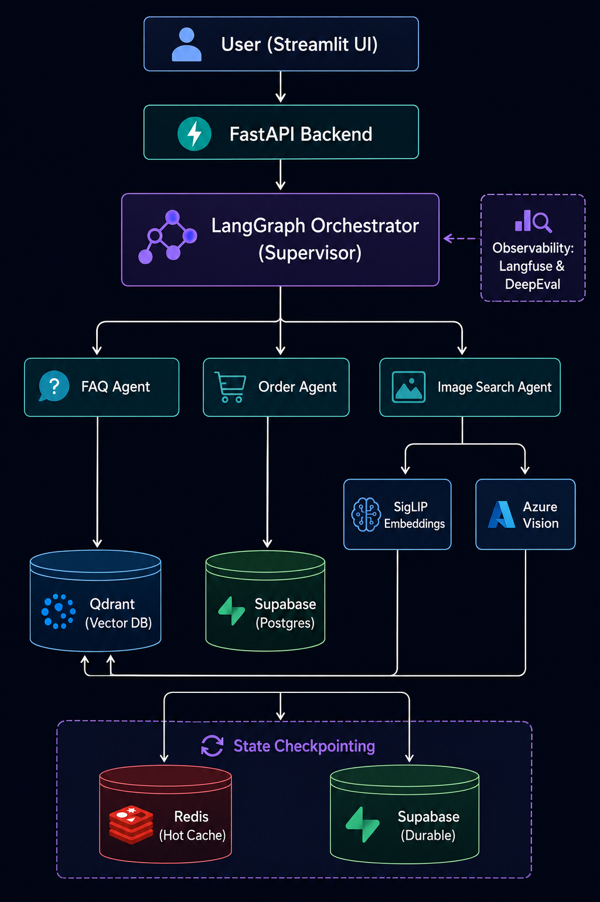

<p align="center">
  <h1 align="center">🛒 E-Commerce Customer Assistant</h1>
  <p align="center">
    An AI-powered multi-agent customer support system with visual product search, built with LangGraph, FastAPI, and Streamlit.
  </p>
</p>

<p align="center">
  <a href="#features">Features</a> •
  <a href="#architecture">Architecture</a> •
  <a href="#tech-stack">Tech Stack</a> •
  <a href="#getting-started">Getting Started</a> •
  <a href="#deployment">Deployment</a> •
  <a href="#api-reference">API Reference</a> •
  <a href="#license">License</a>
</p>

---

## Features

- **🤖 Multi-Agent Orchestration** — A supervisor agent intelligently routes user queries to specialized sub-agents (FAQ, Order, Image Search) using LangGraph's state machine.
- **📦 Order Management** — Customers can check order status, view order details, track shipments, and look up past purchases using natural language.
- **❓ FAQ Knowledge Base** — RAG-powered FAQ agent retrieves answers from a curated knowledge base covering shipping, returns, payments, warranties, and account policies.
- **🖼️ Multimodal Product Search** — Upload a product image and the system extracts tags using Azure Vision and finds visually and semantically similar products via Qdrant Hybrid Search.
- **💬 Persistent Chat Memory** — Dual-layer checkpointing system with Redis (hot cache) and Postgres (durable storage) ensures blazing-fast conversation recall with zero data loss.
- **📝 Automatic Summarization** — A dedicated summarizer agent condenses long conversation histories to keep context windows lean and inference costs low.
- **🔐 JWT Authentication** — Secure, stateless authentication via JSON Web Tokens tied to customer identities.
- **🔄 LLM Fallback Chain** — Primary model (Groq) with automatic fallback to Google Gemini, ensuring high availability.
- **🧪 DeepEval Evaluation** — Built-in test suites using Confident AI's DeepEval framework to measure RAG retrieval and faithfulness.
- **🚀 CI/CD Pipeline** — Fully automated GitHub Actions workflow that builds, containerizes, and deploys to Azure Container Apps on every push.

---

## Architecture



### Agent Descriptions

| Agent | Purpose |
|---|---|
| **Supervisor** | Analyzes user intent and routes to the correct sub-agent(s). Handles greetings and chitchat directly. Supports multi-agent delegation for complex queries. |
| **FAQ** | Performs semantic search over the knowledge base (shipping, returns, payments, warranties, accounts) using Nomic/Gemini embeddings + Qdrant. |
| **Order** | Looks up customer-specific order data from Supabase using tool calls (`order_lookup`, `order_details`, `order_items`). |
| **Image Analyzer** | Uses Azure Computer Vision to extract tags and descriptions from user-uploaded images. |
| **CLIP Embedding** | Converts text queries or images into CLIP embedding vectors for visual similarity search. |
| **Image Search** | Queries the `product_images` Qdrant collection using multimodal fusion hybrid search to find the most visually similar products. |
| **Synthesizer** | Synthesizes responses when multiple agents are triggered simultaneously. |
| **Summarizer** | Compresses long conversation histories into concise summaries to stay within LLM context windows. |

---

## Tech Stack

### Backend
| Technology | Purpose |
|---|---|
| [FastAPI](https://fastapi.tiangolo.com/) | Async REST API framework |
| [LangGraph](https://langchain-ai.github.io/langgraph/) | Multi-agent orchestration state machine |
| [LangChain](https://python.langchain.com/) | LLM abstractions, tools, and embeddings |
| [Langfuse](https://langfuse.com/) | Observability, tracing, and debugging |
| [DeepEval](https://www.confident-ai.com/) | LLM evaluation and unit testing |

### LLM Providers
| Provider | Model | Role |
|---|---|---|
| [Groq](https://groq.com/) | `openai/gpt-oss-20b` | Primary inference |
| [OpenAI](https://openai.com/) | `gpt-4o-mini` | Fallback 1 |
| [Groq](https://groq.com/) | `openai/gpt-oss-120b` | Fallback 2 |

### Embeddings
| Provider | Model | Role |
|---|---|---|
| [OpenRouter (OpenAI)](https://openrouter.ai/) | `openai/text-embedding-3-small` | Primary text embeddings (1024d) |
| [Google Gemini](https://ai.google.dev/) | `gemini-embedding-2` | Fallback text embeddings (768d) |
| [Google SigLIP](https://huggingface.co/google/siglip-base-patch16-224) | `siglip-base-patch16-224` | Image embeddings (768d) |

### Data Stores
| Service | Purpose |
|---|---|
| [Supabase](https://supabase.com/) (Postgres) | Customer data, orders, products, conversations, durable LangGraph checkpoints, and readable JSON state logs (`checkpoint_state_logs`) |
| [Redis](https://redis.io/) | Hot-cache LangGraph checkpoints for fast conversation recall |
| [Qdrant Cloud](https://qdrant.tech/) | Vector database for FAQ semantic search and visual product search |
| [Azure Blob Storage](https://azure.microsoft.com/en-us/products/storage/blobs/) | Product image CDN |

### Frontend
| Technology | Purpose |
|---|---|
| [Streamlit](https://streamlit.io/) | Chat UI with image upload, conversation history, and rich product cards |

---

## Project Structure

```
ecomm-cust-assit/
├── .dockerignore                   # Files to ignore in Docker builds
├── .env                            # Environment variables (local dev)
├── .env.example                    # Sample environment variables
├── .gitignore                      # Files ignored by git version control
├── .python-version                 # Active python version specification
├── Dockerfile                      # Multi-stage container definition
├── README.md                       # Project overview and instructions
├── ecomm_architecture.png          # System architecture design diagram
├── pyproject.toml                  # Project metadata and dependencies (uv)
├── start.sh                        # Entrypoint script to start backend & frontend
├── uv.lock                         # Pinned dependency versions lockfile
├── .github/
│   └── workflows/
│       └── azure-deploy.yml        # CI/CD deployment pipeline
├── app/
│   ├── __init__.py                 # Makes app package importable
│   ├── main.py                     # FastAPI app definition + startup lifespan
│   ├── agents/
│   │   ├── __init__.py
│   │   ├── clip_embedding.py       # CLIP text/image semantic embedding node
│   │   ├── faq.py                  # RAG-based customer support FAQ agent
│   │   ├── image_analyzer.py       # Visual content descriptor agent node
│   │   ├── image_search.py         # Visual similarities lookups coordinator
│   │   ├── order.py                # Order tracker and management agent node
│   │   ├── summarizer.py           # Chats compaction & summarization node
│   │   ├── supervisor.py           # Intents routing agent node (supervisor)
│   │   └── synthesizer.py          # Unified responses synthesis node
│   ├── db/
│   │   ├── __init__.py
│   │   ├── customers.py            # Customer service table logic
│   │   ├── qdrant.py               # Vector collections management client
│   │   ├── schema.sql              # Supabase database table definitions
│   │   └── supabase.py             # Supabase credentials loader
│   ├── graph/
│   │   ├── __init__.py
│   │   ├── builder.py              # LangGraph compilation & workflow setup
│   │   ├── checkpointer.py         # Postgres+Redis double buffer checkpointer
│   │   ├── cleanup.py              # Cleanup intermediate state variables
│   │   ├── state.py                # Core AgentState schema definition
│   │   └── utils.py                # Graph message filtering helpers
│   ├── middleware/
│   │   ├── __init__.py
│   │   ├── auth.py                 # Bearer JWT validator middleware
│   │   └── rate_limit.py           # IP/user api rate limiting middleware
│   ├── rag/
│   │   ├── __init__.py
│   │   ├── image_retriever.py      # SigLIP + BM25 hybrid search processor
│   │   └── retriever.py            # Dense FAQ vector retriever processor
│   ├── schemas/
│   │   ├── __init__.py
│   │   ├── agent.py                # Internal agent API structures
│   │   ├── api.py                  # Frontend REST controller schemas
│   │   ├── order.py                # Order detail parsing templates
│   │   └── search.py               # Search request mapping models
│   ├── services/
│   │   ├── __init__.py
│   │   ├── dense_embedder.py       # SigLIP embedding inference client
│   │   ├── jwt_auth.py             # JWT token encoding & decoding
│   │   ├── llm_factory.py          # Model initialization & fallback loader
│   │   ├── sparse_embedder.py      # BM25 sparse vectors builder
│   │   ├── storage_service.py      # Azure Blob storage uploads wrapper
│   │   └── vision_service.py       # Azure Cognitive Vision integration
│   └── tools/
│       ├── __init__.py
│       ├── faq_search.py           # Qdrant knowledge lookup search tool
│       ├── order_details.py        # Order contents query backend tool
│       ├── order_items.py          # Order details lookup sub-tool
│       └── order_lookup.py         # Customer order index lookup tool
├── data/
│   ├── customers.json              # Sample customer profiles seed
│   ├── orders.json                 # Sample purchases and tracking seed
│   ├── products.json               # Enriched product database seed
│   ├── summaries.log               # Live chat summarizer log output
│   ├── token_usage.jsonl           # LLM API usage tracking data
│   └── faq_knowledge/              # RAG FAQ content markdown database
│       ├── faq_account.md          # User account creation & safety FAQs
│       ├── faq_payment.md          # Checkout methods and payment policies
│       ├── faq_returns.md          # Refund policies and item return procedures
│       ├── faq_shipping.md         # Carrier details and international shipping FAQs
│       └── faq_warranties.md       # Product warranty and claims procedures
├── ingestion/
│   ├── __init__.py
│   ├── create_checkpoint_tables.py # Postgres checkpointer setup script
│   ├── index_catalog.py            # Product visual catalog indexing pipeline
│   ├── ingest_customers.py         # Supabase customers table setup script
│   ├── ingest_faq.py               # FAQ dense embedding indexing pipeline
│   └── ingest_orders.py            # Supabase orders table setup script
├── tests/
│   ├── __init__.py
│   └── evaluations/
│       ├── __init__.py
│       ├── custom_model.py         # Groq metric evaluator judge model
│       ├── mock_dataset.py         # RAG evaluation groundtruth dataset
│       └── test_faq_rag.py         # Faithfulness & relevancy test suites
└── ui/
    └── app.py                      # Streamlit interactive chat UI client
```

---

## Getting Started

### Prerequisites

- **Python 3.12+**
- **[uv](https://docs.astral.sh/uv/)** (recommended) or pip
- **Docker** (optional, for containerized runs)
- API keys for: Groq, Google AI, Nomic, Langfuse
- Accounts on: Supabase, Qdrant Cloud, Redis Cloud

### 1. Clone the Repository

```bash
git clone https://github.com/apurvpanchal-simform/ecomm-cust-assit.git
cd ecomm-cust-assit
```

### 2. Install Dependencies

```bash
uv sync
```

### 3. Configure Environment Variables

```bash
cp .env.example .env
```

Edit `.env` and fill in all required values:

| Variable | Description |
|---|---|
| `GOOGLE_API_KEY` | Google AI API key (for Gemini fallback embeddings) |
| `GROQ_API_KEY` | Groq API key (for primary LLM inference) |
| `NOMIC_API_KEY` | Nomic API key (for optional text embeddings) |
| `OPENAI_API_KEY` | OpenAI API key (for fallback LLM inference) |
| `OPENAI_BASE_URL` | Optional base URL for OpenAI-compatible endpoints |
| `OPENROUTER_API_KEY` | OpenRouter API key (for primary text embeddings) |
| `OPENROUTER_EMBEDDING_MODEL` | OpenRouter embedding model name (e.g., `openai/text-embedding-3-small`) |
| `PRIMARY_MODEL` | Primary LLM model identifier (e.g., `gpt-4o-mini`) |
| `FALLBACK_MODEL` | Fallback LLM model identifier |
| `EMBEDDING_MODEL` | Fallback embedding model identifier |
| `NOMIC_EMBEDDING_MODEL` | Nomic embedding model identifier |
| `CLIP_MODEL` | SigLIP/CLIP model path on Hugging Face |
| `SUPABASE_URL` | Supabase project URL |
| `SUPABASE_KEY` | Supabase service role / anon key |
| `SUPABASE_DB_URL` | Supabase Postgres database connection string |
| `REDIS_URL` | Redis connection string (for checkpoint caching) |
| `QDRANT_URL` | Qdrant Cloud cluster URL |
| `QDRANT_API_KEY` | Qdrant Cloud API key |
| `AZURE_STORAGE_CONNECTION_STRING` | Azure Blob Storage connection string |
| `AZURE_STORAGE_CONTAINER` | Azure Blob container name |
| `AZURE_VISION_ENDPOINT` | Azure Computer Vision endpoint |
| `AZURE_VISION_KEY` | Azure Computer Vision key |
| `JWT_SECRET_KEY` | Secret key for JWT token signing |
| `JWT_EXPIRATION_HOURS` | Token expiry duration in hours (default: `1`) |
| `LANGFUSE_PUBLIC_KEY` | Langfuse public key |
| `LANGFUSE_SECRET_KEY` | Langfuse secret key |
| `LANGFUSE_BASE_URL` | Langfuse base service URL |
| `HF_TOKEN` | Hugging Face access token (to load CLIP/SigLIP models) |

### 4. Set Up Local Services (Redis & Qdrant)

If you prefer to run Redis and Qdrant locally instead of using cloud providers, you can instantly spin them up using Docker:

```bash
# Start local Redis
docker run -d -p 6379:6379 -p 8001:8001 --name ecomm-redis redis/redis-stack:latest

# Start local Qdrant
docker run -d -p 6333:6333 -p 6334:6334 \
    -v $(pwd)/qdrant_storage:/qdrant/storage:z \
    --name ecomm-qdrant \
    qdrant/qdrant
```

*If running locally, update your `.env`:*
- `REDIS_URL=redis://localhost:6379`
- `QDRANT_URL=http://localhost:6333`
- `QDRANT_API_KEY=` *(leave completely blank)*

### 5. Set Up the Database

Run the SQL schema in your Supabase SQL Editor:

```sql
-- Copy and paste the contents of app/db/schema.sql
```

### 6. Seed Data

```bash
python ingestion/ingest_customers.py    # Seed customers
python ingestion/ingest_orders.py       # Seed orders
python ingestion/ingest_faq.py          # Ingest FAQ knowledge base → Qdrant
python ingestion/index_catalog.py       # Index product images → Qdrant + Azure Blob
```

### 7. Run Locally

```bash
# Terminal 1: Start the FastAPI backend
uvicorn app.main:app --reload --port 8000

# Terminal 2: Start the Streamlit frontend
streamlit run ui/app.py --server.port 8501
```

Open your browser to **http://localhost:8501** to start chatting!

---

## Deployment

### Azure Container Apps (Production)

The project includes a fully automated CI/CD pipeline via GitHub Actions.

#### Prerequisites

1. **Azure Container Registry** — to store Docker images
2. **Azure Container Apps** — serverless container hosting
3. **Azure Blob Storage** — for product images
4. **Cloud Databases** — Supabase (Postgres), Redis Cloud, and Qdrant Cloud must be used (local Docker versions cannot be accessed by Azure Container Apps)

#### GitHub Secrets Required

| Secret | Description |
|---|---|
| `AZURE_CREDENTIALS` | Azure Service Principal credentials JSON (see below) |
| `ACR_NAME` | Azure Container Registry name (without `.azurecr.io`) |
| `ACA_APP_NAME` | Azure Container App name |
| `ACA_RESOURCE_GROUP` | Azure Resource Group name |
| `HF_TOKEN` | Hugging Face access token (required to download SigLIP model during Docker build) |

**To generate your `AZURE_CREDENTIALS` JSON:**
Run the following Azure CLI command in your terminal and paste the entire JSON output as the secret value:
```bash
az ad sp create-for-rbac --name "github-actions" --role contributor \
  --scopes /subscriptions/<YOUR_SUBSCRIPTION_ID>/resourceGroups/<YOUR_RESOURCE_GROUP> \
  --sdk-auth
```

#### Deploy

Push to `main` or `develop` to trigger an automatic deployment:

```bash
git push origin develop
```

The GitHub Actions workflow will:
1. Check out the repository
2. Authenticate with Azure
3. Build & push the Docker image to ACR
4. Deploy the new image to Azure Container Apps

---

## API Reference

### Authentication

#### `POST /auth/login`

Authenticate a customer and receive a JWT token.

**Request Body:**
```json
{
  "email": "alice@example.com"
}
```

**Response:**
```json
{
  "access_token": "eyJhbGciOiJIUzI1NiIs..."
}
```

---

### Chat

All chat endpoints require the `Authorization: Bearer <token>` header.

#### `POST /chat`

Send a message (text and/or image) to the AI assistant.

**Request Body:**
```json
{
  "query": "Where is my latest order?",
  "conversation_id": "optional-thread-id",
  "image_base64": null
}
```

**Response:** Full LangGraph state including `messages` with the AI's response.

#### `GET /chat/conversations`

List all conversations for the authenticated customer.

**Response:**
```json
[
  {
    "conversation_id": "abc123",
    "title": "Where is my latest order...",
    "updated_at": "2026-06-07T15:30:00Z"
  }
]
```

#### `GET /chat/history/{conversation_id}`

Retrieve the full message history for a specific conversation.

**Response:**
```json
{
  "messages": [
    { "role": "user", "content": "Where is my order?" },
    { "role": "assistant", "content": "Your order #ORD-1001 is currently..." }
  ]
}
```

#### `DELETE /chat/conversations/{conversation_id}`

Delete a specific conversation from the history.

**Response:**
```json
{
  "status": "deleted"
}
```

---

### E-Commerce Core & Diagnostics

All orders and products endpoints require the `Authorization: Bearer <token>` header.

#### `GET /orders`

Fetch the list of all orders belonging to the authenticated customer.

**Response:**
```json
[
  {
    "id": "ord-1001",
    "customer_id": "cust-abc",
    "status": "shipped",
    "payment_status": "paid",
    "total": 21.87,
    "ordered_at": "2026-06-07T15:30:00Z",
    "items": [...]
  }
]
```

#### `GET /products`

Fetch the complete product catalog.

**Response:**
```json
[
  {
    "id": 1,
    "title": "Fjallraven - Foldsack No. 1 Backpack",
    "description": "Your perfect pack for everyday use...",
    "price": 109.95,
    "image": "https://..."
  }
]
```

#### `GET /health`

Retrieve backend system health status.

**Response:**
```json
{
  "status": "ok"
}
```

---

## Evaluation (DeepEval)

This project uses **DeepEval** (Confident AI) to run test suites on the RAG pipeline.

Run the test suite via the UV CLI:
```bash
uv run deepeval test run tests/evaluations/test_faq_rag.py
```

To see visual insights, tracking, and logs, you can log in to Confident AI:
```bash
uv run deepeval login
```

---

## Observability

This project is fully integrated with **Langfuse** for end-to-end tracing and LLM analytics. To enable tracing, configure the following environment variables:
- `LANGFUSE_PUBLIC_KEY`
- `LANGFUSE_SECRET_KEY`
- `LANGFUSE_BASE_URL` (e.g. `https://us.cloud.langfuse.com`)

Key integrations include:
- Every LangGraph node and tool is decorated with `@observe()` for automatic trace generation.
- LLM inputs and outputs are captured automatically.
- Token cost injection tracking.

Visit your [Langfuse Dashboard](https://langfuse.com/) to view traces and metrics.

---

## License

This project is licensed under the MIT License. See the [LICENSE](LICENSE) file for details.

---

<p align="center">
  Built with ❤️ using LangGraph, FastAPI, and Streamlit
</p>
